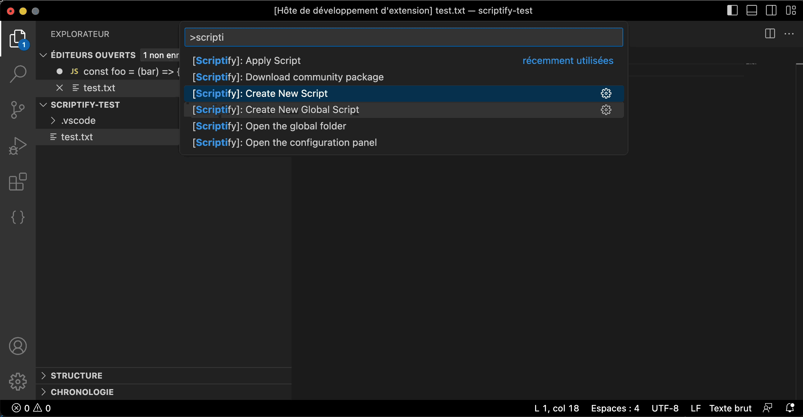

# Scriptify


Scriptify is a Visual Studio Code extension that allows you to create and apply JavaScript scripts to the current selection. With Scriptify, you can easily manipulate selected values using custom scripts.

<p align="center">

</p>

## Features

- **Create and Apply Scripts**: Write and execute JavaScript scripts directly within Visual Studio Code.
- **Customizable Global Scripts**: Create and apply global scripts that can be used across different projects.
- **Download Community Packages**: Explore and download community-created script packages.
- **Configuration Panel**: Easily configure Scriptify settings through the configuration panel.
- **Package Manager Integration**: Select your preferred package manager for script dependency management.

## Getting Started

1. Install the Scriptify extension from the Visual Studio Code marketplace.
2. Open Visual Studio Code and create or open a project.
3. To create a new script, use the command palette `(Ctrl/Cmd + Shift + P)` and select **[Scriptify]: Create New Script**. Enter a name for your script.
4. The script editor will open, allowing you to write your custom JavaScript code.
5. To apply a script to the current selection, use the command palette `(Ctrl/Cmd + Shift + P)` and select **[Scriptify]: Apply Script**. Choose the desired script from the list.
6. Customize Scriptify settings by opening the configuration panel using the command **[Scriptify]: Open the configuration panel**.

## Configuration

Scriptify provides the following configuration options:

- **Global Folder Location**: Overrides the default global folder location. By default, it points to your computer's temp directory.
- **Favorite Package Manager**: Select your preferred package manager (npm, pnpm, yarn) for script dependency management.

## Commands

Scriptify provides the following commands:

- **[Scriptify]: Create New Script**: Create a new script.
- **[Scriptify]: Create New Global Script**: Create a new global script.
- **[Scriptify]: Apply Script**: Apply a script to the current selection.
- **[Scriptify]: Download Community Package**: Download a community script package.
- **[Scriptify]: Open the configuration panel**: Open the Scriptify configuration panel.
- **[Scriptify]: Open the global folder**: Open the global script folder.


## Example

The export of your module should be a function that returns the transformed value or a promise that can return the transformed value.

```js
/**
 * The `transform` function takes two parameters: `selection` and `index`.
 * - `selection`: Represents the selected code.
 * - `index`: Represents the cursor index.
 * 
 * The function should return the transformed value of the `selection`.
 * This example converts the selected code to lowercase.
 *
 * @param {string} selection The code selected by the user.
 * @param {number} index The cursor index.
 * @returns {string} The transformed value of the selection which replace the current selection.
 */
function transform(selection, index) {
  // Convert the selected code to lowercase
  return selection.toLowerCase();
}

module.exports = transform;


```

## Migration from Version 1.x to 2.x

If you are upgrading from Scriptify 1.x to 2.x, please refer to the [migration guide](../docs/migration.md) for detailed instructions on how to migrate your scripts and adapt to the new features and changes.

## Contributing

Contributions to Scriptify are welcome! If you encounter any issues or have suggestions for improvements, please open an issue in the [GitHub repository](https://github.com/imike57/scriptify/issues).


### Sharing a Script
Have you created a script that you would like to share? Feel free to make a pull request and add your scripts to the `packages` folder of the repository. You can publish your package under the `@scriptify-vscode` scope to share it with others.

## Special Thanks

Special thanks to the following contributors who have helped improve and enhance the Scriptify extension:

- [Jordan Skousen](https://github.com/JordanSkousen)

## License

This extension is licensed under the MIT License.